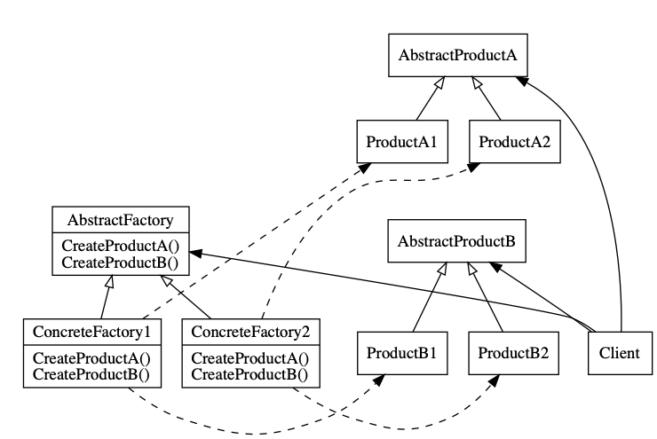

# Creational Pattern

82 page Diagram Implementation.

Maze에 대한 대부분의 세부사항은 무시하고 만들어지는 방법에 포커싱하였지만 기본적인 범위 안에서 최소한 돌아가도록 코드로 구현

MapSite: room 에 enter를 진행하면 위치가 바뀌고 문에 들어가는 경우 열려있으면 다음 방으로 들어가고, 닫혀있으면 다침
MapSite 클래스를 Room, Wall, Door 클래스가 상속하여 공통적으로 가지고 있는 `Enter()` 메서드로 구현
아직 방의 위치가 바뀌었다는 내용은 구현하지 않았음

## Abstract Factory

### Intention

상세화된 서브클래스(specifying concrete classes) 정의 없이도 서로 관련성이 있거나 의존적인 여러 객체의 군을 생성하기 위한 인터페이스를 제공

> := Kit

### Motivation

Example:

> Presentation Manager User Interface

look and feel 표준에 상관없이 프로그램이 이식성을 가지려면, application 이 각 사용자 인터페이스 툴킷에서 제공하는 위젯을 직접 사용하지 못하도록 해야 한다.

- 위젯은 캡슐화를 시켜서 직접 사용하지 못하도록 한다.

기본 유형의 위젯을 생성하기위한 인터페이스를 정의하는 추상 WidgetFactory 클래스를 정의하여 이 문제를 해결할 수 있습니다.
또한 각 종류의 위젯에 대한 추상 클래스가 있으며 구체적인 하위 클래스는 특정 Look and Feel 표준을 위한 위젯을 구현합니다.

### Applicability

- a system should be independent of how its products are created, composed, and represented.
객체가 생성, 구성, 표현되는 방식과 무관하게 독립적인 시스템

- a system should be configured with one of multiple families of products.
여러 제품군 중 하나를 선택해서 시스템을 설정해야 하는 경우.

- a family of related product objects is designed to be used together, and you need to enforce this constraint.
관련된 제품 객체들이 함께 사용되도록 디자인되고, 이 제약이 외부에도 지켜지도록 하고 싶은 경우

- you want to provide a class library of products, and you want to reveal just their interfaces, not their implementations.
제품에 대한 클래스 라이브러리를 제공하고, 그 구현이 아닌 인터페이스를 노출시키고 싶을 때

> DB2API 객체를 예로들 수 있음 - python 의 경우 https://www.python.org/dev/peps/pep-0249/

### Structures



### Participants

- AbstractFactory (WidgetFactory)
abstract 제품 객체를 생성하는 연산으로 인터페이스 정의
Glyph 객체의 개념을 정의

- ConcreteFactory (MotifWidgetFactory, PMWidgetFactory)
구체적인 제품 객체를 생성하는 연산을 구현

- AbstractProduct (Window, ScrollBar)
abstract 제품 객체의 연산에 대한 인터페이스 정의

- ConcreteProduct (MotifWindow, MotifScrollBar)
ConcreteFactory 로부터 생성된 제품 객체를 정의
AbstractProduct 인터페이스를 구현

- Client
AbstractFactory 와 AbstractProduct 클래스로부터 정의된 인터페이스만 사용.

### Collaborations

- ConcreteFactory 클래스의 인스턴스 하나가 일반적으로 런타임에 만들어짐.
이 concrete factory 는 특정 구현을 갖는 제품 객체를 생성.
단사여야 한다(서로다른 제품 객체는 서로다른 concrete factory 를 사용).

- AbstractFactory 는 필요한 제품 객체를 생성하는 책임을 ConcreteFactory 로 위임(defers).

### Consequences

1. It isolates concrete classes.
제품 클래스 이름이 구체 팩토리 구현에서 분리되므로 사용자 코드에는 나타나지 않도록 과정과 책임을 캡슐화


1. It makes exchaging product families easy.
concrete factory 만 변경하여 서로 다른 제품군을 사용할 수 있도록 교체가능

1. It promotes consistency among products.
한번에 한 그룹에서 만든 객체를 사용하도록 함으로써 일관성을 갖도록 보장

1. Supporting new kinds of products is difficult.
추상 팩토리는 제품 집합에만 고정되어 있기 때문에
새로운 종류의 제품이 등장하면 팩토리 구현 및 모든 서브클래스 변경을 해야합니다.

### Implementation

1. Factories as singletons

애플리케이션은 하나의 제품군에 대해 하나의 ConcreteFactory 인스턴스만 있으면 됩니다.
주목할 점은 ConcreteFactory 인스턴스가 Singleton이라는 점
제품군에 대해서 하나면 된다.

1. Creating the products.

AbstractFactory 는 단지 제품을 생성하기 위한 인터페이스를 선언하는 것이고,
그것을 생성하는 책임은 Product의 서브클래스인 ConcreteProduct에 있다.

example: smalltalk

```smalltalk
make: partName
    ^ (partCatalog at: partName) copy
```

```python
def make(part_name):
    # part_catalog: global dictionary[factory]
    return part_catalog[part_name].copy()
```

```smalltalk
addPart: partTemplate named: partName
    partCatalog at: partName put: partTemplate
```

```python
def add_part(part_name, part_template)
    part_catalog[part_name] = part_template
```


```smalltalk
aFactory addPart: aPrototype named: #ACMEWidget
```

```python
class ACMEWidget(Factory):
    def add_part():
        pass
```

1. Defining extensible factories.

Example: Maze

commit:
